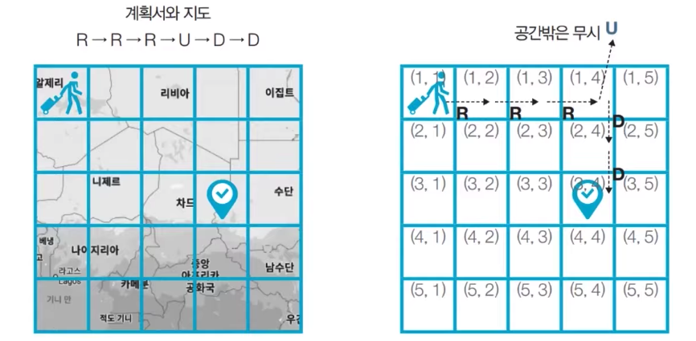

# [👩🏻‍💻문제설명](http://www.kyobobook.co.kr/product/detailViewKor.laf?ejkGb=KOR&mallGb=KOR&barcode=9791162243077)

[이코테 Ch4-1] 상하좌우 (구현)
[](http://www.kyobobook.co.kr/product/detailViewKor.laf?ejkGb=KOR&mallGb=KOR&barcode=9791162243077)

여행가 A는 N × N 크기의 정사각형 공간 위에 서 있다. 이 공간은 1 × 1 크기의 정사각형으로 나누어져 있다. 가장 왼쪽 위 좌표는 (1, 1)이며, 가장 오른쪽 아래 좌표는 (N, N)에 해당한다. 여행가 A는 상, 하, 좌, 우 방향으로 이동할 수 있으며, 시작 좌표는 항상 (1, 1)이다. 우리 앞에는 여행가 A가 이동할 계획이 적힌 계획서가 놓여 있다.

<br>

계획서에는 하나의 줄에 띄어쓰기를 기준으로 L, R, U, D 중 하나의 문자가 반복적으로 적혀있다. 각 문자의 의미는 다음과 같다.

```Python
  L: 왼쪽으로 한 칸 이동
  R: 오른쪽으로 한 칸 이동
  U: 위로 한 칸 이동
  D: 아래로 한 칸 이동
```

<br>

이때 여행가 A가 N × N 크기의 정사각형 공간을 벗어나는 움직임은 무시된다. 예를 들어 (1, 1)의 위치에서 L 혹은 U를 만나면 무시된다. 다음은 N = 5인 지도와 계획서이다.



<br>

이 경우 6개의 명령에 따라서 여행가가 움직이게 되는 위치는 순서대로 (1, 2), (1, 3), (1, 4), (1, 4), (2, 4), (3, 4)이므로, 최종적으로 여행가 A가 도착하게 되는 곳의 좌표는 (3, 4) 이다. 다시 말해 3행 4열의 위치에 해당하므로 (3, 4)라고 적는다. 계획서가 주어졌을 때 여행가 A가 최족적으로 도착할 지점의 좌표를 출력하는 프로그램을 작성하시오.

<br>

**입력**
- 첫째 줄에 공간의 크기를 나타내는 N이 주어진다. (1 <= N <= 100)
- 둘째 줄에 여행가 A가 이동할 계획서 내용이 주어진다. (1 <= 이동 횟수 <= 100)

**출력**
- 첫째 줄에 여행가 A가 최종적으로 도착할 지점의 좌표 (X, Y)를 공백으로 구분하여 출력한다.

<br>

**입력 예시**
5
R R R U D D

**출력 예시**
3 4


<br >

# ✍️Idea Sketch

알고리즘 : 구현

<br>

### 시간복잡도
연산 횟수는 이동 횟수에 비례한다. 이동 횟수가 n인 경우 O(n)이 된다.

<br >


# ✍️내 소스코드 

- 계획서를 입력받아 이동 횟수만큼 for문을 실행한다.
- dx, dy는 L, R, U, D에 따른 이동 방향이다. L, R, U, D에 따른 dx, dy의 인덱스 i를 구한다.
- 새로운 x, y 좌표를 구한 후 N * N의 공간을 벗어나는지 확인한다. 벗어나지 않는 경우 x, y 좌표를 갱신한다.

```Python
  import sys
  si = sys.stdin.readline

  n = int(si())

  x, y = 0, 0
  dx = [0, 0, -1, 1]
  dy = [-1, 1, 0, 0]

  for move in si().split():
    if move == 'L':
      i = 0
    elif move == 'R':
      i = 1
    elif move == 'U':
      i = 2
    elif move == 'D':
      i = 3
    
    nx, ny = x + dx[i], y + dy[i]
    if (0 <= nx < n) and (0 <= ny < n):
      x, y = nx, ny

  print(x + 1, y + 1)

```
